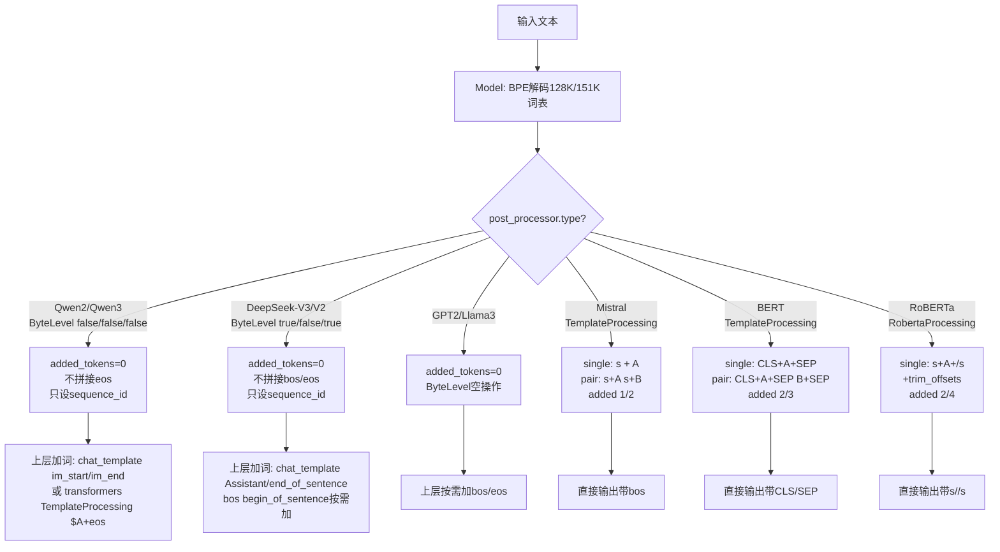

# Tokenizer 后处理方案：主流开源模型对照

## 1. 结论

- `Qwen2 / Qwen3 / DeepSeek-V3` 的 `tokenizer.json` 中 `post_processor` 均为 `ByteLevel` 空操作，`added_tokens = 0`，不拼接任何特殊词。
- 特殊词 `<|endoftext|>`、`<|im_end|>`、`<｜end▁of▁sentence｜>`、`<s>` 不在 Rust 端添加，由 `chat_template` / `transformers.update_post_processor()` 在上层添加。
- 只有 `BERT / RoBERTa / Mistral / T5` 类在 Rust 端用 `TemplateProcessing` 真正加词。

## 2. 联网实测对照表

| 模型 | `post_processor.type` | 参数 | 实际操作 |
|---|---|---|---|
| `Qwen/Qwen2-7B-Instruct` | `ByteLevel` | `add_prefix_space:false, trim_offsets:false, use_regex:false` | 零加词，只 `set_sequence_id` |
| `Qwen/Qwen2.5-7B-Instruct` | `ByteLevel` | 同上 | 同上 |
| `Qwen/Qwen3-0.6B` | `ByteLevel` | 同上 | 同上 |
| `deepseek-ai/DeepSeek-V3` | `ByteLevel` | `add_prefix_space:true, trim_offsets:false, use_regex:true` | 零加词，只 `set_sequence_id` |
| `deepseek-ai/DeepSeek-V2-Lite` | `ByteLevel` | 同上 | 同上 |
| `openai-community/gpt2` | `ByteLevel` | `add_prefix_space:true, trim_offsets:false` | 零加词，GPT-2 范式 |
| `mistralai/Mistral-7B-v0.1` | `TemplateProcessing` | `single:[<s>+A], pair:[<s>+A,<s>+B]` | 自动加 `bos=<s>` |
| `google-bert/bert-base-uncased` | `TemplateProcessing` | `single:[CLS]+A+[SEP]` | 单加2词，双加3词 |
| `FacebookAI/roberta-base` | `RobertaProcessing` | `cls:<s>, sep:</s>` | 单加2词，双加4词 |

验证方式：直取 HF `tokenizer.json` 的 `post_processor` 字段解析，非本地猜测。

## 3. 核心概念

编码管线尾部位置，见 `tokenizers/src/tokenizer/mod.rs:1291`：

```
Input -> Normalizer -> PreTokenizer -> Model(BPE) -> PostProcessor -> Encoding
```

`PostProcessor` trait 只做两件事：

- `added_tokens(is_pair)`：预留特殊词槽位，影响 `stride` / 截断计算。
- `process_encodings(encodings, add_special_tokens)`：把特殊词的 `id / type_id / token / offsets / special_mask` 拼进 `Encoding`。

仓库共 5 种实现，由 `tokenizers/src/processors/mod.rs:20` 的 `PostProcessorWrapper` 分发：

- `tokenizers/src/pre_tokenizers/byte_level.rs:57` 的 `ByteLevel`
- `tokenizers/src/processors/template.rs:339` 的 `TemplateProcessing`
- `tokenizers/src/processors/bert.rs:8` 的 `BertProcessing`
- `tokenizers/src/processors/roberta.rs:9` 的 `RobertaProcessing`
- `tokenizers/src/processors/sequence.rs:8` 的 `Sequence`

关键实现：

- `tokenizers/src/pre_tokenizers/byte_level.rs:175` 的 `PostProcessor for ByteLevel`：`added_tokens` 恒返回 `0`，`trim_offsets=false` 时只调 `set_sequence_id`。
- `tokenizers/src/processors/bert.rs:43` 的 `added_tokens`：单 `2` 双 `3`。
- `tokenizers/src/processors/roberta.rs:58` 的 `added_tokens`：单 `2` 双 `4`，另含 `trim_offsets` 修 `offsets` 逻辑。
- `bindings/python/py_src/tokenizers/implementations/byte_level_bpe.py:59` 的 `ByteLevel`：GPT-2 系默认零加词。
- `bindings/python/scripts/convert.py:312` 的 `TemplateProcessing`：T5 `single` 加 `eos` 范例。

## 4. 流程图



## 5. 参数解释

- `add_prefix_space`：英文前空格习惯。DeepSeek `true`，Qwen `false`。
- `trim_offsets`：是否修 `offsets` 对齐解码空格。Qwen/DeepSeek 均为 `false`，RoBERTa 为 `true`。
- `use_regex`：是否走 GPT-2 正则切分。DeepSeek `true`，Qwen `false`。见 `tokenizers/src/pre_tokenizers/byte_level.rs:64`。
- `single / pair / special_tokens`：仅 `TemplateProcessing` 有。如 Mistral `single=[<s>, A]`，`special_tokens` 登记 `<s>:1`。

## 6. 本地验证点

- `bindings/python/tests/bindings/test_processors.py:85`：`ByteLevel`
- `bindings/python/tests/bindings/test_processors.py:36`：`BertProcessing`
- `bindings/python/tests/bindings/test_processors.py:58`：`RobertaProcessing`
- `tokenizers/src/tokenizer/serialization.rs:239`：仅存 `Qwen/Qwen2-7B-Instruct` 字符串引用，无专有后处理定义。

## 7. 使用建议

看 `Qwen / DeepSeek` 不要只看 `tokenizer.json` 的 `post_processor`，必看 `chat_template` 与 `tokenizer_config.json` 的 `eos_token / add_eos_token`。Rust 端空操作是 decoder-only 大模型的刻意设计，保持与 GPT-2 兼容。
