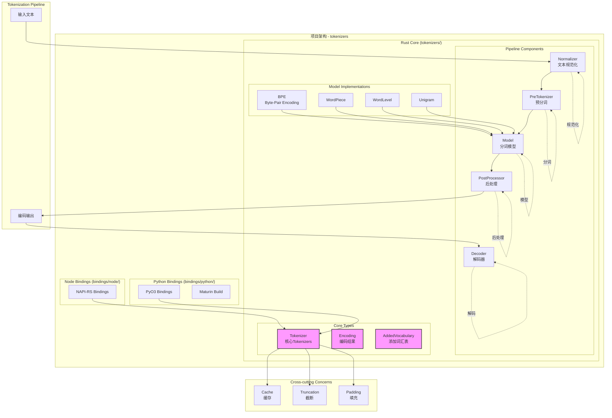
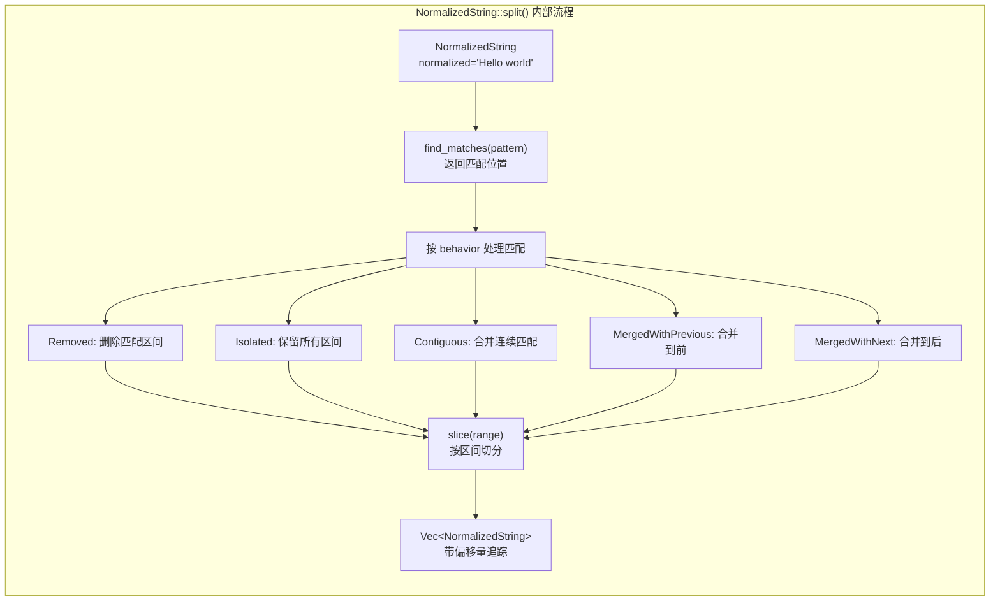
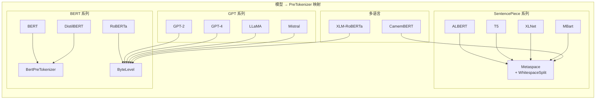
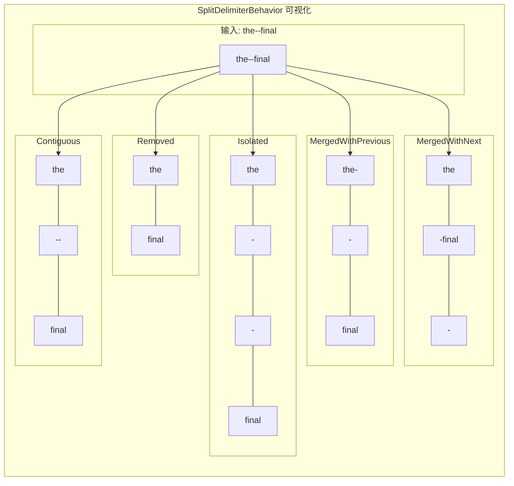
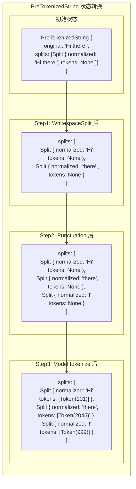
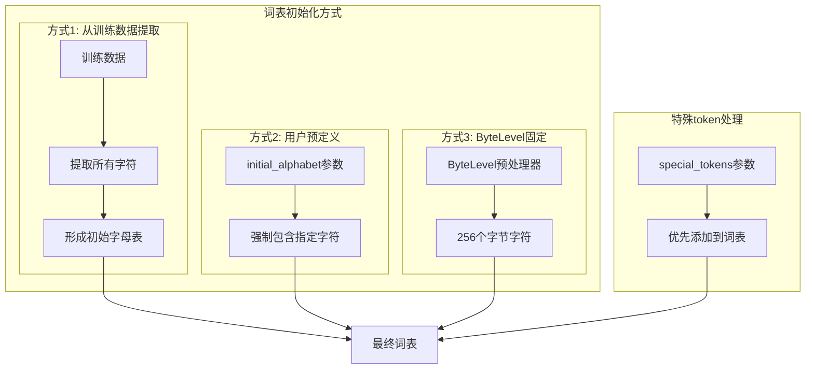

# Tokenizer 项目架构与实现分析

> 为自研 tokenizer 做准备。基于 `/home/zmz/tokenizers` 只读分析生成，未改源码。



## 1. 顶层分层

`tokenizers/src/lib.rs:141-147`：

- `tokenizer/`：编排 + 核心 trait + Encoding + AddedVocabulary + 序列化
- `models/`：BPE / WordPiece / WordLevel / Unigram
- `normalizers/`：14 种文本归一化
- `pre_tokenizers/`：12 种预切分
- `processors/`：5 种后处理（加特殊 token）
- `decoders/`：10 种解码
- `utils/`：并行、截断、填充、进度条、from_pretrained

公共 trait 全在 `tokenizers/src/tokenizer/mod.rs:56-207`：

- `Normalizer: Sync`：`normalize(&mut NormalizedString)`
- `PreTokenizer`：`pre_tokenize(&mut PreTokenizedString)`，可改 `NormalizedString` 但拼接必须能还原
- `Model`：`tokenize/token_to_id/id_to_token/get_vocab/save/get_trainer + tokenize_in_pretokenized`
- `PostProcessor`：`added_tokens + process_encodings`，默认 `process()` 设 `sequence_id/type_ids` 后 merge
- `Decoder`：`decode() = decode_chain().join("")`
- `Trainer`：`feed + train`
- `Token{id, value, offsets}`，offsets 相对 sequence

具体实现经 `*Wrapper` 枚举分发做多态 + serde：

- `models/mod.rs`：`ModelWrapper{BPE,WordPiece,WordLevel,Unigram}` + `TrainerWrapper`
- `normalizers/mod.rs:184-203`：`NormalizerWrapper`
- `pre_tokenizers/mod.rs:45-62`：`PreTokenizerWrapper`
- `processors/mod.rs:29-53`：`PostProcessorWrapper`
- `decoders/mod.rs:152-167`：`DecoderWrapper`

入口：`TokenizerImpl<M,N,PT,PP,D>` 泛型，`Tokenizer` = 全 Wrapper 特化（`tokenizer/mod.rs:440-448`），`Deref/DerefMut` 透传。`TokenizerBuilder` 缺 `model` 则 `build()` 失败。

## 2. Pipeline 数据流

`tokenizers/src/tokenizer/mod.rs:762-953,1178-1317`：

```text
EncodeInput::Single/Dual
-> encode_single_sequence per seq (type_id 0/1)
   -> added_vocabulary.extract_and_normalize(normalizer)
   -> do_pre_tokenize(pretok.pre_tokenize)
   -> do_tokenize: model.tokenize_in_pretokenized(+truncation early-exit) + into_encoding
-> post_process:
   1. truncate（若 add_special_tokens，max_length - n_added_tokens）
   2. processor.process 或 default_process（加 special + sequence_ranges/type_ids/special_mask）
   3. pad（encode_batch 再批量 pad）
-> Encoding
```

`decode:935-953`：

```text
ids
-> added_vocabulary.simple_id_to_token（归一化缓存优先）
-> model.id_to_token
-> skip_special_tokens 过滤 special_tokens_set
-> 有 decoder 则 decoder.decode，否则 join(" ")
```

`encode / encode_char_offsets / encode_fast` 差异仅 `OffsetType::Byte / Char / None`。
`encode_batch*` 用 rayon 并行，`decode_batch` 同理。
`DecodeStream`（`mod.rs:1061-1171`）：流式解码状态机，处理 `byte_fallback` 不完整 UTF-8（返回 `None` 等后续 id）与 strip 类 decoder 的前后依赖（prefix 回溯校验）。

## 3. Offset 追踪核心（自研必抄）

### 3.1 NormalizedString

`tokenizers/src/tokenizer/normalizer.rs:104-117`：

```rust
{ original, normalized: String, alignments: Vec<(start,end)>, original_shift }
```

- `alignments` 每 normalized 字节一项，指向 original 字节区间。
- `transform_range(Range, Iterator<(char,change)>, initial_offset):317-428` 核心：
  `change=1` 新增（复用 `alignments[idx-1]`），`-N` 替换+删后 N 字符，`0` 替换。
- 派生：`nfd/nfkd/nfc/nfkc`、`filter`、`map`、`lowercase/uppercase`、`prepend/append`、`replace`（批量 find_matches 重建）、`lstrip/rstrip/strip`、`split`（`Removed/Isolated/MergedWithPrevious/Next/Contiguous` 后调 `slice`）。
- 查询：`convert_offsets`（Original<->Normalized 双向）、`get_range / get_range_original`、`validate_range`（char 边界）、`slice`（截双串 + 对齐数组平移 + `original_shift` 累加，保证子串仍能回原坐标）。

### 3.2 PreTokenizedString

`tokenizers/src/tokenizer/pre_tokenizer.rs:21-58`：

```rust
Split { normalized: NormalizedString, tokens: Option<Vec<Token>> }
PreTokenizedString { original: String, splits: Vec<Split> }
```

- `split(split_fn):73-103`：逐 `Split.drain`，已有 `tokens` 跳过（不再切），过滤空串。
- 约束：产出拼接回 `original` 必须一致，否则 offset 错乱。
- `normalize / tokenize / tokenize_with_limit` 仅作用于 `tokens.is_none()`。
- `into_encoding:198-263`：要求全 `tokens.is_some`；`OffsetType::None` 直接 `(0,0)`；否则每 token `normalized.convert_offsets(Normalized(token.offsets)) -> offsets_original + start/end`；`Char` 再经 `BytesToCharOffsetConverter:329-363` 转 char 偏移。
- 预切分输入 `word_idx=Some(subseq_idx)`，raw 输入 `None => split idx`。

## 4. Encoding + AddedVocabulary + 截断填充

### 4.1 Encoding

`tokenizers/src/tokenizer/encoding.rs:11-31`：

- `ids`：模型输出 ID
- `type_ids`：序列区分，单 0，双 0/1
- `tokens`：ID 对应字符串
- `words: Vec<Option<u32>>`：所属 word 索引，`None` = 特殊/pad
- `offsets`：最终经 `into_encoding` 转回 Original，默认 byte，char 可选
- `special_tokens_mask`：1 特殊，0 普通
- `attention_mask`：1 有效，0 pad
- `overflowing`：截断溢出，`stride` 重叠保留
- `sequence_ranges`：多序列 token 范围，空 = 单序列全覆盖

操作：`truncate(max_len,stride,Left|Right)` 首段保留余入 overflowing；`merge(growing_offsets)` offsets 累加或归零；`pad` 同步扩向量 + 递归 pad overflowing（pad 处 `words None, offsets(0,0), attention 0, special 1`）。

### 4.2 AddedVocabulary

`tokenizers/src/tokenizer/added_vocabulary.rs:17-167,379-564`：

- `AddedToken{content,single_word,lstrip,rstrip,normalized,special}`，`from(content,special)` 默认 `normalized=!special`。
- `added_tokens_map: String->u32`，`added_tokens_map_r: u32->AddedToken`，`special_tokens_set: HashSet`（解码过滤 O(1)），`normalized_cache`（仅 `normalized=true` 且变化才存，不序列化）。
- 双 trie：`split_trie`（非归一化内容）+ `split_normalized_trie`，皆 `DoubleArrayAhoCorasick + LeftmostLongest`。
- `encode_special_tokens=false` 默认切分 special，true 则跳过 special 使其走普通 model 切分。
- `find_matches`：`leftmost_find_iter`，`single_word` 检查前后 `\w` 边界，`lstrip/rstrip` 吞 `\s*` 且防重叠。
- `extract_and_normalize` 两阶段：原始串先用 `split_trie` 切非归一化 token；剩余 `None` split 先 normalize 再用 `split_normalized_trie` 切。已带 Token split 直接跳过。
- ID 分配：`max(added)+1` 或 `model.get_vocab_size()`，已在 model 内复用原 ID。

## 5. Model 四选一

公共 trait 见 `tokenizer/mod.rs:70-118`。分发与有序词表见 `models/mod.rs`（`OrderedVocabIter` 按 id 升序序列化，hole 警告）。

### 5.1 BPE

文件：`models/bpe/mod.rs`、`model.rs`、`word.rs`、`trainer.rs`、`serialization.rs`、`parity_trainer.rs`。

- 结构：`BPE{vocab,vocab_r,merges: Pair->(rank,new_id),cache,dropout,unk_token,continuing_subword_prefix,end_of_word_suffix,fuse_unk,byte_fallback,ignore_merges}`。
- `tokenize`（`merge_word + merge_all + tokenize_with_cache`）：
  1. 空串直接返回；`ignore_merges` 且整词在 vocab 直接返回。
  2. 按 char 切分，加 prefix/suffix，查 vocab，未知走 `byte_fallback:<0xXX>` 或 `unk_token` 累积（`fuse_unk` 合并相邻）。
  3. `Word::merge_all`：相邻 pair 查 merges 建 `QuaternaryHeap` 最小堆（rank 小优先，同 rank pos 小优先），循环 pop 合并，更新 prev/next 双向链表，`dropout` 随机跳过（绕过 cache）。
  4. 映射 `vocab_r` 生成 `Token`，`len<MAX_LENGTH && len<capacity` 才缓存。
- 缓存：`BpeCache{id: AtomicU64, capacity}` + `thread_local! BPE_LOCAL_CACHE`，`clear()` bump generation。
- Trainer（`feed + do_train`）：
  1. 并行 process 分词计数 `words: CompactString->u64`。
  2. special tokens 优先入词表；`compute_alphabet` + `limit_alphabet` 裁低频，排序保证确定性。
  3. 逐词按字符 + prefix/suffix 展开为 `Word`；并行统计 pair 频次 + 倒排 `where_to_update`。
  4. `OctonaryHeap` 最大堆循环取 top，过期重插，`min_frequency/vocab_size` 终止，并行更新含该 pair 词，回写 counts/queue，`max_token_length` 过滤。
- 序列化：`{"type":"BPE",dropout,unk_token,...,vocab(有序),merges:[[a,b]...]}`，兼容 legacy `"a b"` 字符串经 `convert_merges_to_hashmap`，`#version` 行跳过。`save()`：`vocab.json` + `merges.txt`（按 rank 排序）。

### 5.2 WordPiece

文件：`models/wordpiece/mod.rs`、`trainer.rs`、`serialization.rs`。

- 结构：`WordPiece{vocab,vocab_r,unk_token,continuing_subword_prefix,max_input_chars_per_word}`。
- `tokenize:224` 贪心最长匹配：超长整体 `[UNK]`；`start<len` 循环 `end=len` 向前缩，`start>0` 加 `##` 前缀，命中即推进；任何位置无匹配整体回退单个 UNK，缺 unk 抛 `MissingUnkToken`。
- Trainer：默认 `##` 的 `BpeTrainerBuilder` 包装，`feed` 委托 BPE，`train` 后 `WordPiece::from_bpe` 搬 vocab，丢 merges。
- 序列化：`{"type":"WordPiece",unk_token,continuing_subword_prefix,max_input_chars_per_word,vocab}`；`save()` 单 `vocab.txt` 按 id 排序。

### 5.3 WordLevel

文件：`models/wordlevel/mod.rs`、`trainer.rs`、`serialization.rs`。

- `tokenize:162` 整词精确匹配，无子词切分；未命中查 `unk_token`，缺 unk 抛错。
- Trainer：`feed` 并行计数，按 `(count降,word升)` 排序保证确定性，special 优先 + `count>=min_frequency`，`take(vocab_size)` 分配 id。
- 序列化：`{"type":"WordLevel",vocab,unk_token}`；注意 `ModelWrapper` 反序列化 WordPiece 须排 WordLevel 前（后者为前者子集，legacy 无 type 兼容）。

### 5.4 Unigram（SentencePiece）

文件：`models/unigram/model.rs`、`trie.rs`、`lattice.rs`、`trainer.rs`、`serialization.rs`。

- 结构：`Unigram{token_to_ids,vocab: Vec<(String,f64)>,trie,min_score,unk_id,bos/eos_id,fuse_unk,is_optimized,byte_fallback,alpha,nbest_size}`，`K_UNK_PENALTY=10.0`。
- `Trie<Node{is_leaf,children}>`，`common_prefix_search` 字节前缀迭代器。
- `tokenize`（`encode + tokenize`）：
  1. `alpha None/0` 走 cache + `encode_optimized`，否则 `encode_unoptimized`（采样）。
  2. `populate_nodes`：逐字符起点 trie 前缀搜索插入 `(pos,len,score,id)`；无单字符匹配插 `unk_score=min_score-10`。
  3. optimized：前向 DP `best_path_ends_at` 取最大，回溯拼接，`fuse_unk` 合并连续 UNK。
  4. unoptimized：建 Lattice，`(nbest,alpha)` 选 `viterbi/sample/sample_nbest`。
  5. 映射 id，未知查 `byte_fallback:<0xXX>` 逐字节，否则 `unk_id`，offset 按字节累加。
- Lattice：`viterbi` 按字符拓扑 DP + prev 回溯；`nbest` A* agenda（超 100k 缩至 512）；`populate_marginal` 前后向 `log_sum_exp` 求期望（EM E 步）；`sample/sample_nbest` 加权采样。
- Trainer（SentencePiece 复刻）：句子 `\0` 拼接 + esaxx 后缀数组取高频子串 seed；EM 循环 E 步期望 + M 步 digamma Bayesian 更新；达 `vocab*1.1` 或剪枝阈值停；`prune` 用二-best 切分算删除 loss；`finalize` 强制 required chars + special/unk 置顶，截断 `vocab_size` 按 score 降序。
- 序列化：`{"type":"Unigram",unk_id,vocab:[[token,score]...],byte_fallback}`，经 `Unigram::from` 重建 trie/min_score/cache；`save()` 单 `unigram.json`。

## 6. Normalizer / PreTokenizer / Processor / Decoder 清单

### 6.1 Normalizers（14）

`normalizers/mod.rs:1-16,24-39`，`NormalizerWrapper` untagged 枚举 + `EnumType` 显式 type。

- `BertNormalizer (bert.rs)`：clean_text / 汉字加空格 / NFD 去 mark / lowercase。
- `Strip / StripAccents (strip.rs)`：左右 strip / 去 combining mark。
- `NFD/NFKD/NFC/NFKC (unicode.rs)`：直调 `NormalizedString` 对应方法。
- `Nmt (unicode.rs:44-73)`：删控制字符，多种空白 -> `' '`。
- `Sequence (utils.rs)`：同一对象链式。
- `Lowercase (utils.rs)`：`lowercase()`。
- `Precompiled (precompiled.rs)`：grapheme/char 查表，`diff` 对齐处理。
- `Replace (replace.rs)`：String/Regex -> SysRegex，`decode_chain` 逐段替换。
- `Prepend (prepend.rs)`：非空 prepend。
- `ByteLevel (byte_level.rs)`：每 char 按 UTF8 字节展开 GPT2 `BYTES_CHAR` 映射。

### 6.2 PreTokenizers（12）

```mermaid
graph TB
    subgraph "PreTokenizer 体系"
        subgraph "核心 Trait"
            PT["PreTokenizer trait<br/>pre_tokenize()"]
        end
        
        subgraph "核心类型"
            PTS["PreTokenizedString<br/>original + splits[]"]
            Split["Split<br/>normalized + tokens"]
            NS["NormalizedString<br/>original ↔ normalized"]
        end
        
        subgraph "切分行为"
            SB["SplitDelimiterBehavior"]
            SB1["Removed"]
            SB2["Isolated"]
            SB3["MergedWithPrevious"]
            SB4["MergedWithNext"]
            SB5["Contiguous"]
        end
        
        subgraph "组合器"
            Seq["Sequence<br/>顺序执行多个 PreTokenizer"]
        end
    end
    
    subgraph "PreTokenizer 实现"
        subgraph "空白/单词切分"
            WS["Whitespace<br/>正则 \\w+|[^\w\s]+"]
            WSS["WhitespaceSplit<br/>纯空白切分"]
        end
        
        subgraph "字符类型切分"
            PT_BERT["BertPreTokenizer<br/>空白删除 → 标点隔离"]
            PT_PUNC["Punctuation<br/>标点隔离（可配置行为）"]
            PT_DIGIT["Digits<br/>数字切分（逐位/整体）"]
        end
        
        subgraph "字节级切分"
            PT_BYTE["ByteLevel<br/>GPT-2 正则 + 字节映射"]
        end
        
        subgraph "元空格切分"
            PT_META["Metaspace<br/>空格 → ▁ 替换 + 切分"]
        end
        
        subgraph "自定义切分"
            PT_SPLIT["Split<br/>字符串/正则 + 反转"]
            PT_DELIM["CharDelimiterSplit<br/>单字符分隔符"]
            PT_FIXED["FixedLength<br/>固定字符数切分"]
        end
        
        subgraph "脚本切分"
            PT_UNI["UnicodeScripts<br/>按 Unicode 脚本类别"]
        end
    end
    
    subgraph "执行流程"
        Input["输入文本"] --> PTS
        PTS --> PT
        PT --> |"调用 split()"| NS
        NS --> |"find_matches()"| Pattern["Pattern 匹配"]
        NS --> |"slice()"| Output["Split[] 输出"]
    end
    
    subgraph "与 Model 的关系"
        PT --> |"输出 Split[]"| Model["Model::tokenize()"]
        Model --> Token["Token[]"]
    end
    
    %% 关系连线
    PT --- PTS
    PTS --- Split
    Split --- NS
    
    SB --- SB1
    SB --- SB2
    SB --- SB3
    SB --- SB4
    SB --- SB5
    
    Seq --> |"包含"| PT_BERT
    Seq --> |"包含"| PT_BYTE
    Seq --> |"包含"| PT_META
    
    PT_BERT --> |"Step1: 空白"| SB1
    PT_BERT --> |"Step2: 标点"| SB2
    PT_PUNC --> |"默认"| SB2
    PT_DIGIT --> |"individual"| SB2
    PT_DIGIT --> |"整体"| SB5
    PT_BYTE --> |"Isolated"| SB2
    PT_META --> |"MergedWithNext"| SB4
    PT_SPLIT --> |"可配置"| SB
    PT_DELIM --> |"Removed"| SB1
    PT_UNI --> |"按脚本边界"| SB1
    
    style PT fill:#f9f,stroke:#333,stroke-width:2px
    style PTS fill:#bbf,stroke:#333
    style NS fill:#bbf,stroke:#333
    style SB fill:#bfb,stroke:#333
    style Seq fill:#fbf,stroke:#333
```

```mermaid
graph LR
    subgraph "PreTokenizer 执行顺序示例"
        direction LR
        
        subgraph "BertPreTokenizer"
            B1["输入: Hi there!"] --> B2["Step1: 按空白切分<br/>Removed"]
            B2 --> B3["['Hi', 'there', '!']"]
            B3 --> B4["Step2: 按标点切分<br/>Isolated"]
            B4 --> B5["输出: ['Hi', 'there', '!']"]
        end
        
        subgraph "ByteLevel"
            G1["输入: Hello world"] --> G2["加前缀空格<br/>add_prefix_space"]
            G2 --> G3["GPT-2 正则切分<br/>Isolated"]
            G3 --> G4["字节→Unicode 映射"]
            G4 --> G5["输出: ['Hello', 'Ġworld']"]
        end
        
        subgraph "Metaspace"
            M1["输入: Hi there"] --> M2["空格→▁ 替换"]
            M2 --> M3["加前缀 ▁<br/>prepend_scheme"]
            M3 --> M4["按 ▁ 切分<br/>MergedWithNext"]
            M4 --> M5["输出: ['▁Hi', '▁there']"]
        end
        
        subgraph "Sequence 组合"
            S1["输入: Hi, there!"] --> S2["WhitespaceSplit"]
            S2 --> S3["['Hi,', 'there!']"]
            S3 --> S4["Punctuation"]
            S4 --> S5["输出: ['Hi', ',', 'there', '!']"]
        end
    end
```








`pre_tokenizers/mod.rs:28-43`，全部经 `PreTokenizedString::split/normalize`。

- `BertPreTokenizer`：空白 + BERT 标点两次 split。
- `ByteLevel`：三重角色。pretok 可选 prepend 空格 + GPT2 正则按 Isolated 切分再字节映射；decoder 经 `CHAR_BYTES` 拼字节；PostProcessor 裁首尾空格。
- `CharDelimiterSplit`：单字符 delimiter Removed 切分。
- `Metaspace`：空格 -> `▁`，prepend scheme First/Never/Always，`MergedWithNext` 切分；解码首 `▁` 删、余转空格。
- `Whitespace`：`\w+|[^\w\s]+` + Invert + Removed，词+标点分离。
- `WhitespaceSplit`：`is_whitespace` Removed。
- `Sequence`：依次执行。
- `Split`：String/Regex + invert + behavior 切分。
- `Punctuation`：`ascii_punct || is_punctuation`，默认 Isolated。
- `Digits`：`individual_digits ? Isolated : Contiguous`。
- `UnicodeScripts`：script 变化处断开（`ー→Han`，假名→Han，空格→Any）。
- `FixedLength`：按 char 数定长 `slice(Range::Normalized)`。

### 6.3 Processors（5）

词表初始化方式：


`processors/mod.rs:18-27`，注意 Roberta 放 Bert 前防 untagged 误判。

- `BertProcessing`：单 2 / 对 3 added；单 `[CLS]+enc+[SEP]`，对第二段 `enc+[SEP]`，特殊 token `(0,0)/words None/mask 1`。
- `RobertaProcessing`：单 2 / 对 4；先 trim offsets + 全 type 0；单 `<s>+enc+</s>`，对 `</s>+enc+</s>`。
- `ByteLevel`：复用 pretok 的 trim_offsets。
- `TemplateProcessing`：`single/pair: Template(Vec<Piece>) + special_tokens`，`Piece::{Sequence{id,type_id},SpecialToken}`，`$A/$B/$0/$:` 语法，`count_added` 预计算。
- `Sequence`：added 求和，链式 `process_encodings`。

### 6.4 Decoders（10）

`decoders/mod.rs:27-40`，ByteLevel/Metaspace 复用 pretok，Replace 复用 normalizer。

- `BPEDecoder`：suffix 默认 `</w>`，末 token 去 suffix、余转空格。
- `WordPiece`：首不动，余去 `##` 否则前加空格，可选 cleanup。
- `ByteFallback`：`<0xHH>` 攒字节，`from_utf8` 成则合并否则每字节 `�`。
- `CTC`：dedup + 删 pad + `|` -> 空格 + wordpiece cleanup。
- `Fuse`：`join("")`。
- `Strip`：首尾去指定 content。
- `Sequence`：链式 `decode_chain`。

## 7. 序列化 + 绑定

### 7.1 tokenizer.json

源：`tokenizers/src/tokenizer/serialization.rs:15-48`，`SERIALIZATION_VERSION="1.0"`，9 字段固定：

```json
{
  "version": "1.0",
  "truncation": null,
  "padding": null,
  "added_tokens": [{"id": 0, "content": "[SPECIAL]", "single_word": false, "lstrip": false, "rstrip": false, "normalized": false, "special": true}],
  "normalizer": null,
  "pre_tokenizer": null,
  "post_processor": null,
  "decoder": null,
  "model": {"type": "WordPiece"}
}
```

各部件内部 tagged `{"type":"BPE"/"WordPiece"/"ByteLevel"/"BertProcessing"/...}` + 各自字段，反序列化经 `TokenizerBuilder` 重建，added_tokens 最后 `add_tokens` 恢复并校验 ID。

### 7.2 Python 绑定

`bindings/python/`：`cdylib`，`pyo3=0.29`，maturin，`requires-python>=3.10`。

- `src/lib.rs`：`#[pymodule(gil_used=false)]`，导出 `PyEncoding/PyToken/PyAddedToken/PyTokenizer/...` + 子模块，全局 tokio runtime。
- `src/tokenizer.rs`：`PyTokenizer{Arc<RwLock<Tokenizer>>}`，`from_str/from_file/from_buffer/from_pretrained/to_str/save`，`__getstate__/__setstate__` 用 serde_json，encode/batch/decode/train 释 GIL。
- `src/models.rs / normalizers.rs / pre_tokenizers.rs / processors.rs / decoders.rs`：`PyModel/PyNormalizer/...` 基类 + 具体类 `extends=`，`__getstate__/__repr__`。
- `py_src/tokenizers/implementations/`：`base_tokenizer / bert_wordpiece / byte_level_bpe / char_level_bpe / sentencepiece_bpe / sentencepiece_unigram` 高层预置。
- `*.pyi` 由 `tools/stub-gen` 生成，`make check-style` 重生成（非只读）。

### 7.3 Node 绑定

`bindings/node/`：`cdylib`，`napi=3`，`tokenizers path=../../tokenizers`。

- `src/tokenizer.rs`：`#[napi] Tokenizer{Arc<RwLock<RsTokenizer>>}`，同步 save/fromString/fromFile + `AsyncTask` 的 encode/decode/train。
- `src/arc_rwlock_serde.rs`：解决 JS 侧不可直接 serde 内部锁。
- `src/models.rs / normalizers.rs / ...`：扁平工厂 `BPE/WordPiece/...::init/empty/fromFile`，委托读写锁。
- 无 pickle / from_pretrained；`index.d.ts` 由 NAPI-RS 生成。

| Rust 核心 | Python PyO3 | Node napi |
|---|---|---|
| `TokenizerImpl/AddedToken` | `PyTokenizer/PyAddedToken` | `Tokenizer/AddedToken` |
| `ModelWrapper/BPE/...` | `PyModel/PyBPE/...` | `Model/BPE/...` |
| `NormalizerWrapper` | `PyNormalizer/...` | `Normalizer/...` |
| `PreTokenizerWrapper` | `PyPreTokenizer/...` | `PreTokenizer/...` |
| `PostProcessorWrapper` | `PyPostProcessor/...` | `Processor/...` |
| `DecoderWrapper + DecodeStream` | `PyDecoder/... + DecodeStream` | `Decoder/...` |
| `Encoding/Token` | `PyEncoding/PyToken` | `JsEncoding` |

## 8. 性能点

- `utils/parallelism.rs`：rayon `encode_batch / decode_batch / train.feed` 并行，`RAYON_RS_NUM_THREADS` 可调。
- BPE `thread_local! BPE_LOCAL_CACHE + AtomicU64 generation` 缓存 `Word`，`len<MAX_LENGTH` 才缓存，`dropout` 绕过缓存。
- `Model::tokenize_in_pretokenized` 允许持锁实现一次锁住整个 pretoken 序列（Python/Node 的 `Arc<RwLock>` 覆盖），省每 pretoken 一次原子操作。
- `train_from_files`：`BufReader(1MB) + lines_with_ending` 保留换行 + `ResultShunt` 并行 feed。

## 9. 自研 tokenizer 准备：最小路径建议

目标：Character-level Tokenizer+BPE+byte_fallback

- 规范化：minimal/identity路线设置`tok.normalizer = None`——原文直通，大小写/重音/全角/空白/控制字符全保留；特殊token切分仍在normalizer之前按原文进行；存盘`"normalizer": null`，Rust侧`with_normalizer(None)`。
- 预分词：
    - 标点符号边界，附着前面。连续标点符号不分开，一起附着前面。
    - 启用UnicodeScripts分离不同语言。
    - 数字与字母/汉字分开，但数字内部默认保持连续，不逐位切；具体 tokenizer 再根据模型和任务决定是否把长数字进一步细分。
    - Whitespace/空白边界，不替换空格，附着后面。


1. 定接口：`normalize(text)->str+align / pre_tokenize->Vec<Span> / tokenize(span)->Vec<Token{id,value,offsets}> / post_process / decode`，先抄五 trait 形状。
2. 先实现 `WordLevel`（精确查表）打通 `raw -> normalize -> split（空白/标点） -> 查表 -> Encoding{ids,offsets} -> decode` 全链 + offset 还原单测。
3. 再加 `BPE` 或 `WordPiece` 二选一：BPE 需 pair rank 表 + 合并堆 + cache；WordPiece 仅贪心最长匹配，代码量小，推荐起步。
4. 再加 `AddedVocabulary` trie（可用 regex / Aho-Corasick 先替代 `DoubleArrayAhoCorasick`）+ `TemplateProcessing` + `truncate/pad`。
5. Trainer 最后：`feed 计数 -> 按频次/确定性排序建词表 -> 合并`，BPE 堆逻辑最复杂，单测用小语料对拍 HF 输出。
6. 兼容 HF：读写 `tokenizer.json v1.0` + `vocab.json/merges.txt`，保证 `from_file` 可加载。

待确认：目标（教学原型 / 生产级 / 兼容HF）、语言（Rust从零 / Python优先 / 已有代码改）、算法（BPE / WordPiece / Unigram / WordLevel）。

## 10. 交接

12 种 PreTokenizer 实现详细描述