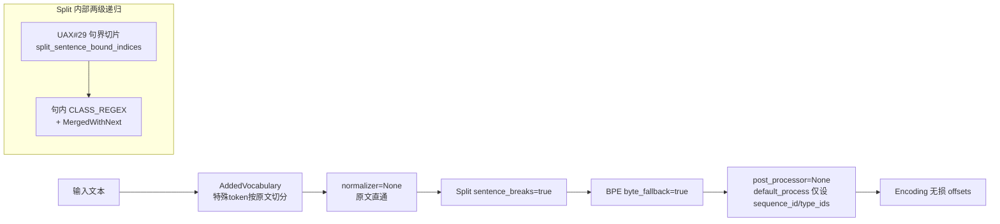

## 用户需求
按两份设计文档实现自研 tokenizer 的核心 feature：在 `Split` 预分词器上新增可选的 UAX #29 句界感知能力（`sentence_breaks` 字段），并产出符合目标管线（normalizer=None + UAX29 句界预分词 + BPE+byte_fallback + post_processor=None）的 Python 训练示例脚本。

## 产品概述
在 huggingface/tokenizers 仓库内实现"无损原文直通"的预分词方案：单 `Split` 节点内部走两级递归——外层按 UAX #29 句界切片（`unicode-segmentation::split_sentence_bound_indices`），内层在每句内运行 CLASS_REGEX（Han/Kana/Latin/数字三分支 + 空白前缀 + JUNK 吸收）+ `MergedWithNext`。硬约束：不增删改任何字符（splits 拼接 == 输入，offsets 无损回原文）。

## 核心功能
- `Split` 新增 `sentence_breaks: bool` 字段（serde `default` + `skip_serializing_if`，旧 JSON 零回归；`Split::new` 签名不变）
- `pre_tokenize` 分流：`sentence_breaks=true` 时走句界递归通道，层间句界物理不可跨越；`invert` 语义为句内取反
- `sentence.rs`（已实现未注册）补 `dedup`，仅声明 `pub mod sentence;`（供等价性测试参照），不注册进 `PreTokenizerWrapper`、不改 serde 形状
- 完整测试：无损 property、句界三断言（含反例 `"a\r\nb\n\nc"`）、与两级 `Sequence([SentenceSplit, Split])` 逐例等价、SentenceBreakTest.txt 官方一致性、文档 §2 规则矩阵 + 多语言 golden
- Python binding：`PySplit` 加 `sentence_breaks=False` 参数 + getter/setter + docstring，stub 由 `make check-style` 重生成
- 示例脚本：按目标配置组装 Tokenizer（`BPE(byte_fallback=True)`、`normalizer=None`、`Split(CLASS_REGEX, MergedWithNext, sentence_breaks=True)`、`post_processor=None`、特殊 token 经 added_tokens 注册），训练存盘并断言 `"normalizer": null`、`"post_processor": null` 落盘 + encode/decode 往返无损

## 明确不做
性能测试与 §7 优化档、注册 SentenceSplit（wrapper/serde/Python 导出）、Node binding、两套文档源更新、默认 TemplateProcessing。


## 技术栈选择
沿用仓库现有栈（无任何新增依赖）：
- **Rust core**（cwd `tokenizers/`）：stable Rust + rustfmt + clippy（`make lint`）；`unicode-segmentation = "1.11"` 已在 `tokenizers/Cargo.toml:84` 依赖树中
- **Python binding**（cwd `bindings/python/`）：PyO3 0.29 + maturin，Python 3.10+；pytest
- 测试数据：`make data/SentenceBreakTest.txt`（经 `hf` CLI 从 `hf-internal-testing/tokenizers-test-data` 下载，缺 CLI 时用 `HF="uvx --from huggingface_hub hf"`）

## 实现方案
方案已被设计文档锁定，照此实现：**单 `Split` 节点 + 递归通道**。

1. **为什么句界必须在递归层**：`Pattern::find_matches` 产出 run 列表后由 `NormalizedString::split` 对整份列表折叠，`MergedWithNext` 会跨越"pattern 内部构造的边界"（反例 `"a\r\nb\n\nc"` 丢边界 1、4）；而 `PreTokenizedString::split`（`tokenizer/pre_tokenizer.rs:73-103`）逐层递归，层间边界不可跨越。故外层句界 slice + 内层句内跑原 `regex + behavior`，逐例等价于两级 `Sequence`。
2. **无损性由构造保证**：所有切点经 `normalized.slice(Range::Normalized(a..b))` 生成，alignments 继承原文坐标，不触碰 `normalizer.rs`。
3. **向后兼容**：`sentence_breaks` 用 `#[serde(default, skip_serializing_if = "is_false")]`——序列化 `false` 时不落字段（现有 `serialization` 测试断言的 JSON 串不受影响），反序列化缺省为 `false`（旧 tokenizer.json 零回归）；`Split::new(pattern, behavior, invert)` 签名不变，新字段构造后置 `false`。
4. **SentenceSplit 不注册**：仅在 `mod.rs` 加一行 `pub mod sentence;` 使其可编译（其自带测试同时激活，且作为 `Sequence` 等价性参照可用），不加 `PreTokenizerWrapper` 变体/`EnumType`/`impl_enum_from!`——serde 形状不变。
5. **Python 侧**：`PySplit::new` 加第 4 个可选参数 + `sentence_breaks` getter/setter（复用现有 `getter!`/`setter!` 宏模式），CLASS_REGEX 固化为示例脚本常量；`.pyi` 不手改，由 `make check-style` 重生成后检查 diff。

## 实现注意事项
- **分句口径先实测**：`split_sentence_bound_indices` 对 `"a\r\nb\n\nc"`、`"段一。\n\n段二。"` 的输出先写断言锁定，split.rs 与 sentence.rs 共用同一口径（设计文档风险 3）；`starts` 需 `push(len)` + `dedup` 防御零长句 → 空 split（sentence.rs 同步补 `dedup`）。
- **regex 是 `SysRegex`（fancy-regex/onig 双引擎）**：句内直接复用 `NormalizedString::split(&SysRegex, behavior)`，不新增 `Pattern`、不改 `SplitPattern`；onig 下 `\p{White_Space}` 属性名可能不支持，示例脚本中 CLASS_REGEX 用文档 §2 的显式类备选并注释。
- **`make check-style` 非只读**：会重建 extension 并重生成 `.pyi`、修 stub imports，执行后必须检查 stub diff；不要手改 `.pyi`。
- **爆炸半径控制**：改动集中在 `split.rs` 一个文件（+sentence.rs 的 `dedup` + mod.rs 一行）；`behavior=Removed` 与无损前提冲突仅在文档注释说明，不做运行时限制；不改 `Sequence`、`UnicodeScripts`、`Digits` 任何行为。
- **根目录无 Cargo workspace**：所有 cargo/make 命令在 `tokenizers/` 或 `bindings/python/` 内运行。

## 架构设计
改动在现有 pipeline 的 PreTokenizer 层内闭环，不引入新架构模式：



等价性参照（仅测试用，不进序列化）：`Sequence([SentenceSplit, Split])` 与单节点逐例相等（含 offsets）。

## 目录结构

```
tokenizers/  (cwd)
├── src/pre_tokenizers/
│   ├── split.rs                 # [MODIFY] 核心改动：Split 加 `sentence_breaks: bool` 字段（serde default + skip_serializing_if=is_false）；SplitHelper 加同名 `#[serde(default)]` 字段兼容旧 JSON；Clone/PartialEq 带该字段；pre_tokenize 顶部分流——true 时走新增 `sentence_aware_segments(&NormalizedString, &SysRegex, behavior)`（外层句界 starts+push(len)+dedup，每句 slice(Range::Normalized) 后句内 `sentence.split(regex, behavior)`）；附带 §5 全部单元测试（无损 property、句界三断言、Sequence 等价、§2 规则矩阵、多语言 golden、口径实测锁定）
│   ├── sentence.rs              # [MODIFY] 仅补 `offsets.dedup()`（防御零长句），与 split.rs 口径统一；现有测试保持通过
│   └── mod.rs                   # [MODIFY] 仅加 `pub mod sentence;` 一行（使类型可编译、测试可用作参照）；不动 PreTokenizerWrapper/EnumType/impl_enum_from!
└── tests/
    └── sentence_break.rs        # [NEW] UAX #29 官方一致性集成测试：读 `data/SentenceBreakTest.txt`（先 `make data/SentenceBreakTest.txt` 获取），对 SentenceSplit 逐条比对 ÷/× 断言"恰好相等"；文件缺失时跳过（遵循仓库 fixtures 模式）

bindings/python/  (cwd)
├── src/pre_tokenizers.rs        # [MODIFY] PySplit::new 签名加 `sentence_breaks = false`（`#[pyo3(signature = (pattern, behavior, invert = false, sentence_breaks = false))]` + text_signature）+ `sentence_breaks` getter/setter（getter!/setter! 宏）+ docstring 补 Args 说明；__getnewargs__ 不变
├── tests/bindings/
│   └── test_pre_tokenizers.py   # [MODIFY] TestSplit 增加：参数实例化与 getter/setter、JSON 往返（含 sentence_breaks=true 落盘/回读）、旧 JSON（无该字段）反序列化兼容、行为断言（pre_tokenize_str 句界用例含 "a\r\nb\n\nc"）
├── examples/
│   └── train_uax29_bpe.py       # [NEW] 目标管线示例：Tokenizer(BPE(byte_fallback=True, unk_token=None))；normalizer=None；pre_tokenizer=Split(Regex(CLASS_REGEX), behavior="merged_with_next", sentence_breaks=True)；post_processor=None；added_tokens 注册特殊 token；BpeTrainer 训练小语料 → save；断言落盘 JSON `"normalizer": null`、`"post_processor": null`、pre_tokenizer.sentence_breaks=true、model.byte_fallback=true；encode→decode 往返 + offsets 连续无重叠无损断言
└── py_src/tokenizers/pre_tokenizers/__init__.pyi  # [MODIFY 自动生成] 由 `make check-style` 重生成，禁止手改；执行后检查 diff
```

## 关键代码结构

```rust
// tokenizers/src/pre_tokenizers/split.rs
#[derive(Debug, Serialize)]
#[serde(tag = "type")]
pub struct Split {
    pub pattern: SplitPattern,
    #[serde(skip)]
    pub regex: SysRegex,
    pub behavior: SplitDelimiterBehavior,
    pub invert: bool,
    #[serde(default, skip_serializing_if = "is_false")]
    pub sentence_breaks: bool,
}

fn is_false(b: &bool) -> bool { !*b }

/// 外层 UAX #29 句界；内层每句跑原 pattern + behavior
fn sentence_aware_segments(
    normalized: &NormalizedString,
    regex: &SysRegex,
    behavior: SplitDelimiterBehavior,
) -> Result<Vec<NormalizedString>>;
// starts = split_sentence_bound_indices 起点 + push(len) + dedup；
// 每句 slice(Range::Normalized(w[0]..w[1])) 后 extend(sentence.split(regex, behavior))
```

CLASS_REGEX（示例脚本常量，文档 §2，JUNK 排除 `\p{N}`、不用 `[\p{L}]` 兜底）：
`\p{White_Space}*(?:[\p{Han}\p{Hiragana}\p{Katakana}\u30FC]+(?:[^\p{White_Space}\p{L}\p{N}]*[\p{Han}\p{Hiragana}\p{Katakana}\u30FC]+)*|[\p{Latin}]+(?:[^\p{White_Space}\p{L}\p{N}]*[\p{Latin}]+)*|\p{N}+(?:[^\p{White_Space}\p{L}]*\p{N}+)*)`

